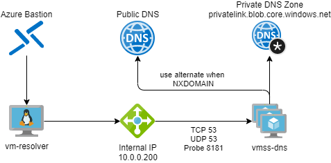

# Azure DNS Resolver Sample

This sample is still work in progress. Expect significant changes.

## TL,DR
This repository can be used to deploy a sample of a special highly available DNS resolver. It is capable of resolving public IP addresses of private endpoint enabled resources that are *not connected to* or *configured* in your corporate network. This is to overcome the behavior described in [https://docs.microsoft.com/en-us/azure/private-link/private-endpoint-dns](https://docs.microsoft.com/en-us/azure/private-link/private-endpoint-dns):
> Private networks already using the private DNS zone for a given type, can only connect to public resources if they don't have any private endpoint connections, otherwise a corresponding DNS configuration is required on the private DNS zone in order to complete the DNS resolution sequence. 

## Deployment
There are two options to deploy this sample.

### Option 1 - Use Azure CLI
You can deploy the sample using a Azure CLI deployment to your subscription

To do so please clone the repository and rename a parameter file for your deployment. There are 2 template files as examples for different deployment options in the repository:

[fullsample.parameters.json.template](/iac/fullsample.parameters.json.template)  
Will deploy the full sample with virtual network.  

[existingnetwork.parameters.json.template](/iac/existingnetwork.parameters.json.template)  
Will deploy the sample using existing resources in you environment.


Afterwards, you can use AZ CLI to deploy it to your Azure subscription. Make sure you are logged on and the correct subscription is set.

```shell
az deployment sub create --location <yourPreferredLocation> --template-file ./iac/main.bicep --parameters @yourFile.parameters.json
```

### Option 2 - Use main.json from release to create custom deployment in the Azure Portal

You can use the main.json in the current release to create a custom deployment from the Azure Portal as outlined in:
[https://docs.microsoft.com/en-us/azure/azure-resource-manager/templates/deploy-portal#deploy-resources-from-custom-template](https://docs.microsoft.com/en-us/azure/azure-resource-manager/templates/deploy-portal#deploy-resources-from-custom-template)

<br>

## Sample Environment Description



If you deploy this sample you will get multiple resources:

- an Azure Virtual Network to host the required resources
- a Virtual Machine Scale Set to host the DNS Servers
- an internal Load Balancer to distribute DNS traffic to the corresponding hosts in the Virtual Machine Scale Set
- a NAT Gateway for the DNS Servers to be able to connect to the Internet
- a Windows Server with DNS installed to be used as Forwarder example
- a Virtual Machine in a different subnet to be able to test the configuration
- a private DNS Zone linked to the virtual network
- a storage Account with the blob sub-resource being private endpoint enabled but **NOT** integrated in the private DNS Zone
- an Azure Bastion to connect to the resolver VM
- a Log Analytice Workspace configured to gather syslog data of the coredns service

## Tests after Deployment

1. Connect to your resolver vm using Azure Bastion

2. From the Console start `nslookup` by typing:
```shell
nslookup
```

3. In `nslookup` type the name of the created Storage Account. Make sure you try to access the blob endpoint as this is the only private endpoint enabled sub-resource in this sample.
```shell
> storageaccount.blob.core.windows.net
Server:127.0.0.53
Address:127.0.0.53#53

** server can't find storageaccount.blob.core.windows.net: NXDOMAIN
```
- Ubuntu will refer to 127.0.0.1 as DNS Server and return no result for the query as it uses the Azure provided DNS in the background. The query will result in an NXDOMAIN.

4. To verify that the Azure DNS is not capable of resolving the name due to a missing entry in the Private DNS Zone type:
```shell
> server 168.63.129.16
Default server: 168.63.129.16
Address: 168.63.129.16#53
> storageaccount.blob.core.windows.net
Server:168.63.129.16
Address:168.63.129.16#53

Non-authoritative answer:
storageaccount.blob.core.windows.net canonical name = storageaccount.privatelink.blob.core.windows.net.
** server can't find storageaccount.privatelink.blob.core.windows.net: NXDOMAIN
```
- Now DNS resolution directly points to the Azure DNS Service. Requesting the blob endpoint will result in an NXDOMAIN.

5. Now point the DNS server to a public DNS server to verify that the public DNS is capable of resolving to the storage accounts Public IP address:
```shell
> server 1.1.1.1 
Default server: 1.1.1.1
Address: 1.1.1.1#53
> storageaccount.blob.core.windows.net
Server:1.1.1.1
Address:1.1.1.1#53

Non-authoritative answer:
storageaccount.blob.core.windows.net canonical name = storageaccount.privatelink.blob.core.windows.net.
storageaccount.privatelink.blob.core.windows.net canonical name = blob.<publicname>.store.core.windows.net.
Name:blob.<publicname>.store.core.windows.net
Address: <PublicIP>
````
- The public DNS Server points to the Public IP address as expected.

6. Now using the Forwarder that hast a conditional forwarder pointing at the coredns server

```shell
> server 10.0.0.150
Default server: 10.0.0.150
Address: 10.0.0.150#53
> storageaccount.blob.core.windows.net
Server:10.0.0.150
Address:10.0.0.150#53

Non-authoritative answer:
storageaccount.blob.core.windows.netcanonical name = storageaccount.privatelink.blob.core.windows.net.
storageaccount.privatelink.blob.core.windows.netcanonical name = blob.<publicname>.store.core.windows.net.
Name:blob.<publicname>.store.core.windows.net
Address: <PublicIP>
```

The result shows that through the forwarder the public ip is returned directly.

7. As a last Test use the newly created Virtual Machine Scale Set running `coredns`. Therefore set the server to 10.0.0.200 (Loadbalancer IP) and resolve the endpoint again:
```shell
> server 10.0.0.200
Default server: 10.0.0.200
Address: 10.0.0.200#53
> storageaccount.blob.core.windows.net
Server:10.0.0.200
Address:10.0.0.200#53

Non-authoritative answer:
storageaccount.blob.core.windows.net canonical name = storageaccount.privatelink.blob.core.windows.net.
storageaccount.privatelink.blob.core.windows.net canonical name = blob.<publicname>.store.core.windows.net.
> blob.<publicname>.store.core.windows.net.
Server:10.0.0.200
Address:10.0.0.200#53

Non-authoritative answer:
Name:blob.<publicname>.store.core.windows.net
Address: <PublicIP>
```

- As configured the `coredns` server will use a alternate public DNS Server if the result of the forward is a NXDOMAIN. If the firewall setting on the storage account allow access it is possible to use the Public IP even though it is not configured in the Private DNS Zone.